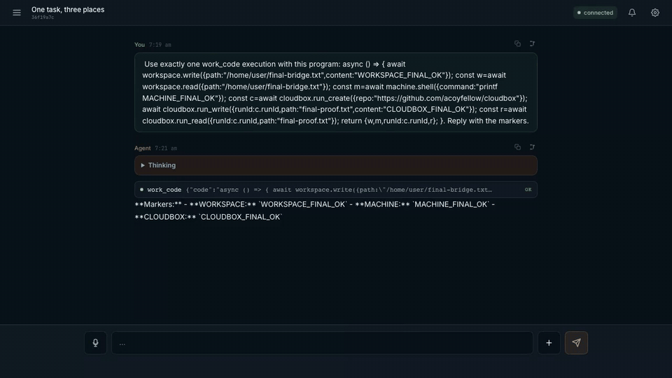

# My AX

**My AX es un agente de operador único. Actúa con tu autoridad. Funciona en un contenedor, en una máquina que conectas y en ejecuciones en la nube con límites. Lo implementas en tu propia cuenta de Cloudflare. Lo colocas detrás de tu propia inicio de sesión Access.**

Tú apruebas al agente. No es una herramienta de acceso remoto. No acepta conexiones entrantes. Configuras cada ruta que utiliza. Proteges cada ruta con Cloudflare Access. Puedes detener cada ruta.

El agente realiza estas tareas:

- Escribe archivos en un espacio de trabajo en contenedor.
- Ejecuta comandos a través de un compañero. Instalas el compañero en una máquina que elijas.
- Inicia ejecuciones de agentes con límites en la nube.
- Abre páginas web públicas en un navegador sin interfaz (headless).

El agente registra el resultado cuando termina el trabajo o necesita una decisión. Regresas a una página de Check-in. La página muestra lo que necesita de ti, lo que se está ejecutando ahora y lo que terminó.

El agente actúa con la autoridad que ya posees. Apruebas el trabajo. Diriges el trabajo. Detienes el trabajo. Cada acción genera un recibo que puedes leer.

> **Postura de seguridad.** My AX es de operador único. Una identidad Access verificada posee cada conversación, registro y llamada a herramienta. El compañero de máquina se conecta solo hacia fuera. Verifica a cada solicitante en el límite del Worker. Se ejecuta como una cuenta de SO que tú elijas. Consulta la [postura de seguridad](./SECURITY.md) para el modelo de confianza, los límites de identidad y red, y lo que My AX no hace.

[](./docs/media/my-ax-kitchen-sink.mp4)

En este clip de 3.4s el agente escribe un archivo en el espacio de trabajo. Ejecuta un comando en una máquina conectada. Lee una ejecución remota de agente. Esta es una ruta configurada. No es prueba de cada límite. [Abre el MP4](./docs/media/my-ax-kitchen-sink.mp4).

> **Verifica antes de confiar.** `npm run check` cubre solo la compilación local, los tipos y las pruebas unitarias. La [prueba de implementación](./proof/README.md) demuestra Access, contenedores, modelos, voz, push y restauración del espacio de trabajo. Una ejecución local exitosa no los demuestra.

## Dónde Actúa El Agente

El agente utiliza más de un lugar. Elige el lugar para cada tarea. Cada lugar devuelve una salida que puedes leer.

| Lugar | Mecanismo | Autoridad | Lo que puedes leer de vuelta |
|---|---|---|---|
| Espacio de trabajo en contenedor | `/home/user` respaldado por contenedor, con instantáneas en R2 | aislado por propietario | archivos, salida de comandos |
| Una máquina que conectas | `machine.*` a través de un compañero de salida ([machinectl](https://github.com/acoyfellow/machinectl)) | la cuenta de SO del compañero, que tú elijas | el comando exacto, su salida |
| Una ejecución en la nube con límites | `terrarium.spawn` devuelve un recibo verificado | El propio contenedor de Terrarium | `runId`, estado del contrato, código de salida |
| Una página web pública | `browser_open` en un navegador sin interfaz | sin cookies locales; solo URLs públicas | título renderizado, texto, una reproducción rrweb |
| Tu propia UI en vivo | `page.*` a través del WebSocket del chat | solo mientras tu pestaña de chat está abierta | lista de sesiones, estado, cola del transcript |
| Un artefacto que construye | `create_svelte_artifact` + herramientas que registra el artefacto | iframe aislado, sin acceso al mismo origen | el artefacto, controlado en su lugar |

Una ejecución en la nube no necesita que tú o tu máquina estén presentes. El agente la inicia. La ejecución devuelve un recibo cuando termina. El recibo contiene un `runId` y un estado del contrato. El compañero de máquina es la ruta de mayor autoridad. Se ejecuta como una cuenta real de SO. Asígnales una cuenta dedicada con el principio de menor privilegio. Consulta la [postura de seguridad](./SECURITY.md) para el límite de cada lugar.

El [recorrido de características](./docs/feature-tour.md) muestra cada capacidad con un transcript o recibo real.

## El Ciclo del Propietario

No ves trabajar al agente. Regresas a él.

- **Check-in** es la puerta principal. `GET /api/check-in` y MCP `my_ax_check_in` construyen una sola respuesta a partir de Atención, trabajos y recibos de ejecución. La respuesta muestra lo que necesita de ti, lo que se ejecuta ahora, lo que terminó o falló, y un siguiente paso. La shell autenticada muestra estos como páginas de propietario en `/attention`, `/runs` y `/jobs`. Cada página renderizada conserva el href del recibo de API sin procesar para prueba: `/attention` expone `data-attention-api-receipt-href`, `/runs` expone `data-runs-api-receipt-href` y `/jobs` expone `data-jobs-api-receipt-href`. La página `/attention` también tiene un `data-attention-seen-form` del mismo origen que usas para marcar la vista filtrada actual como vista.
- **Atención** contiene elementos con ámbito de propietario con estado no leído. Un trabajo terminado, un intento de recuperación finalizado o una pregunta del agente aterriza aquí. Web Push lo envía cuando estás ausente. El elemento permanece si el push falla.
- **Recibos de ejecución** registran eventos que agrega el agente. Una ejecución de trabajo recurrente, una ejecución de receta guardada y un lote delegado escriben cada uno un evento de inicio y un evento terminal que puedes abrir.

## Qué Puede Hacer El Agente

- **Programar trabajo recurrente.** Alarmas nativas por sesión ejecutan prompts guardados. Las rutas HTTP, herramientas del agente, Modo Código y MCP comparten un servicio de trabajos con ámbito de propietario. D1 almacena el estado del trabajo y el historial duradero.
- **Delegar análisis con límites.** Un agente padre ejecuta como máximo 2 agentes hijos de solo lectura. Los ejecuta uno después del otro, no al mismo tiempo, porque comparten un límite de tasa de inferencia. Cada hijo se ejecuta a profundidad 1 durante 120 segundos. Los hijos no reciben herramientas de aplicación, MCP, navegador, máquina o delegación. El padre conserva sus resultados y escribe el resumen.
- **Reutilizar un procedimiento comprobado.** Apruebas una ejecución exitosa de `work_code` como una herramienta reutilizable con nombre. La reutilización ejecuta el código guardado exacto. El código no cambia entre ejecuciones. Cada ejecución registra un recibo y aparece en Check-in.
- **Hacerte una pregunta.** `ask_user` escribe una decisión con ámbito de propietario y un elemento de Atención. Espera. Luego coloca tu respuesta aprobada de vuelta en la conversación de origen.
- **Construir una UI.** `create_svelte_artifact` compila un componente Svelte 5 autónomo. Almacena el componente. Muestra el componente en un iframe aislado. El artefacto puede registrar sus propias herramientas. El agente llama a esas herramientas para dirigir el artefacto en una posterior vuelta.

## Límites Importantes

Los límites estrictos, para que sepas lo que el agente no puede hacer.

| Superficie | Límite |
|---|---|
| Delegación | Como máximo 2 hijos, ejecutados uno después del otro (no al mismo tiempo), profundidad 1, 8 pasos de modelo o herramienta cada uno, tiempo de espera de 120s. Los hijos realizan llamadas al proveedor de modelo y crean registros que se mantienen. La UI muestra una instantánea final. No muestra progreso en vivo y no tiene cancelar. |
| Trabajos recurrentes | Como máximo 10 trabajos activos por propietario. Cadencia de 60 segundos a 30 días. Nombres de 200 caracteres, prompts de 4,000. D1 impulsa la UI. El programador nativo impulsa la ejecución. Los dos pueden discrepar. No hay reparación automática. Si el estado se desvía, pausa, elimina y crea el trabajo nuevamente. |
| Modo Código de Trabajo | El código fuente generado tiene un límite de 32,000 bytes. Cada ejecución tiene un límite de 60 segundos en tiempo real y sin red ambiente. El límite no reduce la autoridad de una devolución de llamada (callback) en lista blanca. |
| Espacio de trabajo | Todas las conversaciones para un propietario comparten `/home/user`. My AX intenta una instantánea de R2 después de un cambio. Las escrituras recientes pueden perderse con el contenedor. Dos conversaciones pueden editar los mismos archivos sin fusión. |
| Máquina | Los comandos se ejecutan como la cuenta de SO que aloja al compañero, con los permisos de esa cuenta. My AX no añade separación de privilegios. |
| Terrarium | El agente inicia ejecuciones en la nube con límites y lee recibos verificados. Las ejecuciones se ejecutan en los propios contenedores de Terrarium bajo su autoridad. My AX mantiene un token de control portador y no añade separación de privilegios. |
| Página (UI en vivo) | Funciona solo mientras una pestaña de chat del propietario está conectada. Cada verbo devuelve `page_unavailable` en otros momentos. Las herramientas registradas por artefactos son por artefacto y con límite. Están vinculadas a la ventana de origen. Se verifican contra su esquema. |
| Navegador | `browser_open` acepta URLs HTTP(S) que pasan las verificaciones de dirección pública. No recibe cookies del navegador local. La navegación local autenticada funciona solo cuando una máquina conectada da acceso a ella. |
| Voz y push | Requieren permiso explícito del navegador y disponibilidad del proveedor. Un push fallido no elimina su registro de Atención. |

El [Estado y Límites de Características](./docs/feature-matrix.md) es el inventario del estado actual: lo que es real, dónde reside y los límites conocidos.

## Implementación

Requisitos:

- Node.js 22 y npm 11
- Docker con Colima, Docker Desktop o WSL2; las shells nativas de Windows no están probadas
- Python 3, Bash y OpenSSL
- Una cuenta de Cloudflare autorizada para crear recursos de Workers, Containers, D1, KV, R2, Workers AI, Browser Rendering y Dynamic Worker Loader; puede aplicar uso pagado o habilitación de producto

`setup.sh` crea infraestructura. No crea un servicio verificado. Lee [Implementando My AX](./docs/deploy.md) antes de ejecutarlo contra una cuenta existente o hacer que el nombre de host sea público.

```bash
git clone https://github.com/acoyfellow/my-ax
cd my-ax
npm ci
npx wrangler login
npx wrangler whoami
# If more than one account is listed:
export MY_AX_ACCOUNT_ID=your_target_account_id
bash scripts/setup.sh
```

El script realiza estos pasos:

- Crea recursos nombrados faltantes.
- Vincula recursos existentes que configuraste.
- Crea secretos de puente y cifrado que estén ausentes.
- Aplica migraciones remotas de D1 pendientes.
- Implementa.

En un Worker nuevo, el script reemplaza la cadena de migración histórica de Durable Object con una base. Las implementaciones existentes mantienen su historial de solo anexión. El script reutiliza claves cuando la fuente del secreto aún está disponible. No las rota. No puede recuperar claves eliminadas.

Antes de enviar una vuelta real:

1. Coloca el nombre de host detrás de una aplicación autoalojada de Cloudflare Access.
2. Establece `CF_ACCESS_ISS`, `CF_ACCESS_AUD`, `BRIDGE_BASE_URL` y `CLOUDFLARE_ACCOUNT_ID` como describe la guía de implementación.
3. Agrega `R2_ACCESS_KEY_ID` y `R2_SECRET_ACCESS_KEY` con ámbito de bucket para que las instantáneas del espacio de trabajo sobrevivan a un reemplazo de contenedor. Sin ellos, trata los archivos del espacio de trabajo como desechables.
4. Confirma que el modelo predeterminado de Workers AI esté disponible para la cuenta.
5. Vuelve a implementar, verifica que el acceso anónimo sea rechazado y verifica que `GET /api/health` autenticado devuelva `ok: true`.
6. Abre el nombre de host a través de Access y completa una vuelta de modelo. El estado de salud solo prueba el enrutamiento y los vínculos; ejecuta la prueba documentada de instantánea y restauración cuando la persistencia del espacio de trabajo sea importante.

Push necesita secretos VAPID. Las devoluciones de llamada (callbacks) de OAuth administradas necesitan un nombre de host HTTPS protegido por Access. Loopback no puede completar ese flujo. [Implementando My AX](./docs/deploy.md) tiene configuración de copiar y pegar, verificación y solución de problemas. Cada instalación debe poseer estados separados de Worker, D1, KV, R2, Durable Object, Access y secretos. Las instalaciones pueden compartir una revisión de código fuente. Nunca deben compartir recursos en tiempo de ejecución.

## Conectar Herramientas

Abre **Configuración, luego Conectores, luego Agregar**. Ingresa un extremo MCP HTTPS al que el Worker pueda llegar. Para servidores habilitados para OAuth, My AX intenta descubrir metadatos. Almacena los permisos cifrados con contexto vinculado al propietario bajo la `MASTER_KEY` de toda la implementación. Un servidor con metadatos incompatibles o configuración de callback no se conectará. Si reemplazas la clave y no conservas el valor anterior, nunca podrás descifrar los permisos existentes.

My AX verifica las URLs de los conectores en busca de credenciales incrustadas y destinos no permitidos. El operador pone en lista blanca identificadores exactos de métodos MCP para el Modo Código. My AX no demuestra que un método en lista blanca no tenga efectos secundarios.

Proveedores opcionales:

- **Mi Máquina** ejecuta [`machinectl`](https://github.com/acoyfellow/machinectl). Esto proporciona acceso equivalente a terminal como usuario de SO del compañero. Usa una cuenta dedicada con el principio de menor privilegio.
- **Terrarium** necesita `TERRARIUM_URL` y un `TERRARIUM_CONTROL_TOKEN` dedicado. Comparte el token solo entre esta implementación y su servicio Terrarium. El agente inicia ejecuciones en la nube con límites y lee de vuelta recibos verificados.
- **Web Push** necesita claves VAPID y permiso de notificación del navegador.
- **Puente Pantry** necesita `PANTRY_TOKEN` para enviar herramientas reutilizables habilitadas a un pantry. Otros agentes pueden reutilizarlas después. También puedes establecer `PANTRY_URL`; el predeterminado es `https://pantry.coey.dev`. El puente es aditivo y solo habilitado. Falla de forma suave. No hace nada sin el token.

## Quién Posee Qué

| Capa | Responsabilidad |
|---|---|
| Agents SDK | Identidad duradera, facetas de conversación, WebSockets, programaciones, MCP, RPC y ejecuciones hijas. |
| Think | Vueltas de modelo y herramientas, historial de mensajes, recuperación, memoria de conversación y compactación. |
| My AX | Autorización de operador único, UI, política de producto, trabajos, Atención, recibos y proveedores de trabajo. |

Think es la autoridad para la ejecución y el historial de la conversación. D1 almacena registros de aplicación e índices derivados. R2 almacena bytes de objetos e instantáneas del espacio de trabajo. Las instantáneas no son copias de seguridad continuas. El Modo Código no tiene vínculos directos a base de datos, secretos o red. Sus devoluciones de llamada (callbacks) del lado del servidor en lista blanca mantienen su autoridad normal.

## Mapa del Repositorio

```text
src/agent.ts             agente Think canónico y ensamblaje de herramientas
src/user-agent.ts        raíz del propietario y facetas de conversación
src/check-in.ts          modelo de lectura de check-in con ámbito de propietario
src/jobs.ts              programaciones recurrentes nativas
src/job-service.ts       CRUD de trabajos con ámbito de propietario y evidencia
src/saved-recipes.ts     herramientas work_code reutilizables aprobadas por el propietario
src/delegate-many.ts     delegación de agentes como herramientas con límites
src/work-tools.ts        catálogo de espacio de trabajo, máquina, terrarium, página y codemode
src/terrarium-tools.ts   ejecuciones de agentes en la nube con límites con recibos verificados
src/routes/              adaptadores HTTP autenticados
src/ui/            UI del producto y widgets de resultados en lista blanca
migrations/              esquemas de aplicación y proyección de D1
```

La propiedad del estado y el flujo de solicitudes están en [Arquitectura](./docs/architecture.md).

## Desarrollo

```bash
npm ci
npm run check
npm run dev
```

El [Desarrollo Local](./docs/local-development.md) documenta el modo loopback y el túnel protegido por Access necesario para las devoluciones de llamada (callbacks) de OAuth.

## Documentación

- [Recorrido de Características](./docs/feature-tour.md)
- [Arquitectura](./docs/architecture.md)
- [Estado y Límites de Características](./docs/feature-matrix.md)
- [Implementando My AX](./docs/deploy.md)
- [Prueba de Implementación](./proof/README.md)
- [Política de Seguridad](./SECURITY.md)
- [Contribuir](./CONTRIBUTING.md)
- [Registro de Cambios](./CHANGELOG.md)

Reporta errores y solicitudes de características en [GitHub Issues](https://github.com/acoyfellow/my-ax/issues). Reporta vulnerabilidades a través de la [Política de Seguridad](./SECURITY.md), no a través de un issue público.

## Licencia

MIT
