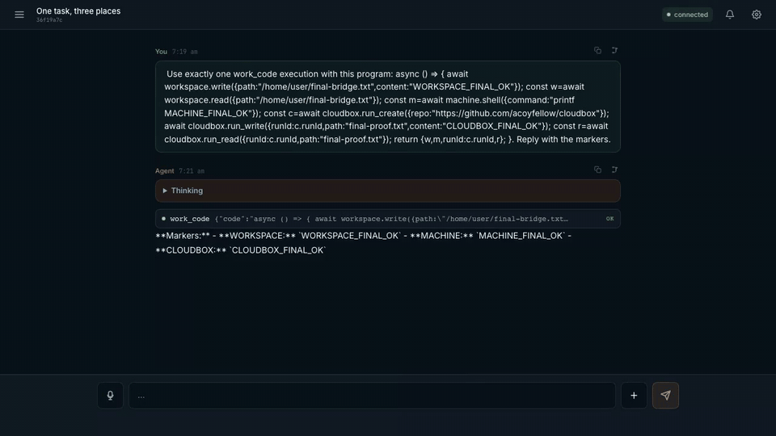

# My AX

**My AX is a single-operator agent that acts with your authority across a container, a machine you connect, and bounded cloud runs. You deploy it into your own Cloudflare account, behind your own Access login.**

You authorize the agent. It is not a remote-access tool and takes no inbound connection. Every path it uses is one you configure, gate with Cloudflare Access, and can stop. It writes files in a container workspace, runs commands through a companion you install on a machine you choose, starts bounded agent runs in the cloud, and opens public web pages in a headless browser. When work finishes or needs a decision, it records the result. You return to a check-in page that reports what needs you, what is running, and what finished.

The agent acts with the authority you already hold, made explicit. You approve the work, steer it, and stop it. Every action writes a receipt you can read.

> **Security posture.** My AX is single-operator. One verified Access identity owns every conversation, record, and tool call. The machine companion connects outbound only, authenticates every caller at the Worker boundary, and runs as an OS account you choose. See the [security posture](./SECURITY.md) for the trust model, the identity and network boundaries, and what My AX does not do.

[](./docs/media/my-ax-kitchen-sink.mp4)

In this 3.4s clip the agent writes a workspace file, runs a command on a connected machine, and reads a remote agent run. That is one configured path, not proof of every boundary. [Open the MP4](./docs/media/my-ax-kitchen-sink.mp4).

> **Verify before trusting.** `npm run check` covers local build, types, and unit tests only. Access, containers, models, voice, push, and workspace restoration are proven by the [deployment proof](./proof/README.md), not by a green local run.

## Where The Agent Acts

The agent uses more than one place. It picks the place for each task. Each place returns output you can inspect.

| Place | Mechanism | Authority | What you can read back |
|---|---|---|---|
| Container workspace | container-backed `/home/user`, snapshotted to R2 | isolated per owner | files, command output |
| A machine you connect | `machine.*` over an outbound companion ([machinectl](https://github.com/acoyfellow/machinectl)) | the companion's OS account, which you choose | the exact command, its output |
| A bounded cloud run | `terrarium.spawn` returns a verified receipt | Terrarium's own container | `runId`, contract status, exit code |
| A public web page | `browser_open` in a headless browser | no local cookies; public URLs only | rendered title, text, an rrweb replay |
| Your own live UI | `page.*` over the chat WebSocket | only while your chat tab is open | session list, health, transcript tail |
| An artifact it builds | `create_svelte_artifact` + tools the artifact registers | sandboxed iframe, no same-origin access | the artifact, driven in place |

A cloud run does not need you or your machine present. The agent starts it. The run returns a receipt with a `runId` and a contract status when it finishes. The machine companion is the highest-authority path: it runs as a real OS account, so give it a dedicated least-privilege account. See the [security posture](./SECURITY.md) for the boundary on each place.

A [feature tour](./docs/feature-tour.md) walks each capability with a real transcript or receipt.

## The Owner Loop

You do not watch the agent work. You return to it.

- **Check-in** is the front door. `GET /api/check-in` and MCP `my_ax_check_in` compose one response from Attention, jobs, and run receipts: what needs you, what is running, what finished or failed, and a suggested next step. The authenticated shell renders those as owner pages at `/attention`, `/runs`, and `/jobs`, and keeps the raw API receipt href on each link for proof.
- **Attention** holds owner-scoped items with unread state. A finished job, an exhausted recovery attempt, or a question from the agent lands here. Web Push delivers it when you are away; the item stays if push fails.
- **Run receipts** record explicitly appended events. A recurring job run, a saved-recipe run, and a delegated batch each write start and terminal events you can open.

## What The Agent Can Decide To Do

- **Schedule recurring work.** Native per-session alarms run saved prompts. HTTP routes, agent tools, Code Mode, and MCP share one owner-scoped job service. D1 holds job state and durable history.
- **Delegate bounded analysis.** A parent runs at most 2 concurrent read-only child agents, depth 1, 120s each. Children get no application, MCP, browser, machine, or delegation tools. The parent keeps their retained results and writes the synthesis.
- **Reuse a proven procedure.** You approve a successful `work_code` run as a named reusable tool. Reuse runs the exact saved code, so there is no regeneration drift. Each run records a receipt and appears in Check-in.
- **Ask you a question.** `ask_user` writes an owner-scoped decision and an Attention item, waits, then injects your validated answer back into the source conversation.
- **Build a UI.** `create_svelte_artifact` compiles a self-contained Svelte 5 component, stores it, and renders it in a sandboxed iframe. The artifact can register its own tools, which the agent then calls to steer it on a later turn.

## Important Limits

The hard bounds, so you know what the agent cannot do.

| Surface | Boundary |
|---|---|
| Delegation | At most 2 concurrent children, depth 1, 8 model/tool steps each, 120s timeout. Children incur model-provider calls and create retained records. The UI shows a terminal snapshot, not live progress or cancel. |
| Recurring jobs | At most 10 active jobs per owner. Cadence 60 seconds to 30 days. Names 200 characters, prompts 4,000. D1 drives the UI while the native scheduler drives execution, and they can disagree. There is no automatic repair; if state drifts, pause, delete, and recreate. |
| Work Code Mode | Generated source is limited to 32,000 bytes. Each execution has a 60-second wall-clock limit and no ambient network. Confinement does not reduce the authority of an allowlisted callback. |
| Workspace | All conversations for one owner share `/home/user`. After a mutation, My AX attempts an R2 snapshot. Recent writes can be lost with the container, and concurrent conversations can edit the same files without a merge. |
| Machine | Commands run as the OS account hosting the companion, with that account's permissions. My AX adds no privilege separation. |
| Terrarium | The agent spawns bounded cloud runs and reads verified receipts. Runs execute in Terrarium's own containers under its authority. My AX holds a bearer control token and adds no privilege separation. |
| Page (live UI) | Works only while an owner chat tab is connected. Each verb errors `page_unavailable` otherwise. Artifact-registered tools are per-artifact, capped, bound to the source window, and validated against their schema. |
| Browser | `browser_open` accepts HTTP(S) URLs that pass public-address checks and receives no local browser cookies. Authenticated local browsing works only when a connected machine exposes it. |
| Voice and push | Depend on explicit browser permission and provider availability. A failed push does not remove its Attention record. |

[Feature Status and Limits](./docs/feature-matrix.md) is the current-state inventory: what is real, where it lives, and the known limits.

## Deploy

Requirements:

- Node.js 22 and npm 11
- Docker with Colima, Docker Desktop, or WSL2; native Windows shells are not tested
- Python 3, Bash, and OpenSSL
- A Cloudflare account authorized to create Workers, Containers, D1, KV, R2, Workers AI, Browser Rendering, and Dynamic Worker Loader resources; paid usage or product enablement may apply

`setup.sh` creates infrastructure. It does not produce a verified service. Read [Deploying My AX](./docs/deploy.md) before you run it against an existing account or expose the hostname.

```bash
git clone https://github.com/acoyfellow/my-ax
cd my-ax
npm ci
npx wrangler login
npx wrangler whoami
# If more than one account is listed:
export MY_AX_ACCOUNT_ID=your_target_account_id
bash scripts/setup.sh
```

The script creates missing named resources, binds configured existing ones, generates absent bridge and encryption secrets, applies pending remote D1 migrations, and deploys. On a fresh Worker it replaces the historical Durable Object migration chain with one baseline; existing deployments keep their append-only history. When the secret source is still available, rerunning setup reuses keys rather than rotating them; it cannot recover deleted keys.

Before you send a real turn:

1. Put the hostname behind a Cloudflare Access self-hosted application.
2. Set `CF_ACCESS_ISS`, `CF_ACCESS_AUD`, `BRIDGE_BASE_URL`, and `CLOUDFLARE_ACCOUNT_ID` as the deployment guide describes.
3. Add bucket-scoped `R2_ACCESS_KEY_ID` and `R2_SECRET_ACCESS_KEY` so workspace snapshots survive a container replacement. Without them, treat workspace files as disposable.
4. Confirm the default Workers AI model is available to the account.
5. Redeploy, verify anonymous access is rejected, and verify authenticated `GET /api/health` returns `ok: true`.
6. Open the hostname through Access and complete one model turn. Health proves routing and bindings only; run the documented snapshot and restore proof when workspace persistence matters.

Push needs VAPID secrets. Managed OAuth callbacks need an Access-gated HTTPS hostname; loopback cannot complete that flow. [Deploying My AX](./docs/deploy.md) has copy-paste configuration, verification, and troubleshooting. Each installation must own separate Worker, D1, KV, R2, Durable Object, Access, and secret state. Installations may share a source revision but must never share runtime resources.

## Connect Tools

Open **Settings, then Connectors, then Add**, and enter an HTTPS MCP endpoint the Worker can reach. For OAuth-enabled servers, My AX attempts metadata discovery and stores grants encrypted with owner-bound context under the deployment-wide `MASTER_KEY`. Incompatible metadata or callback configuration will not connect. Replacing the key without keeping the old value permanently prevents decryption of existing grants.

Connector URLs are screened for embedded credentials and disallowed destinations. The operator allowlists exact MCP method identifiers for Code Mode; My AX does not prove that an allowlisted method is side-effect-free.

Optional providers:

- **My Machine** runs [`machinectl`](https://github.com/acoyfellow/machinectl). This grants terminal-equivalent access as the companion's OS user. Use a dedicated least-privilege account.
- **Terrarium** needs `TERRARIUM_URL` and a dedicated `TERRARIUM_CONTROL_TOKEN` shared only by this deployment and its Terrarium service. The agent spawns bounded cloud runs and reads back verified receipts.
- **Web Push** needs VAPID keys and browser notification permission.
- **Pantry bridge** needs `PANTRY_TOKEN` (and optionally `PANTRY_URL`, default `https://pantry.coey.dev`) to push enabled reusable tools to a pantry for reuse by other agents. It is additive, enabled-only, fail-soft, and a no-op without the token.

## Who Owns What

| Layer | Responsibility |
|---|---|
| Agents SDK | Durable identity, conversation facets, WebSockets, schedules, MCP, RPC, and child runs. |
| Think | Model and tool turns, message history, recovery, conversation memory, and compaction. |
| My AX | Single-operator authorization, UI, product policy, jobs, Attention, receipts, and work providers. |

Think is authoritative for conversation execution and history. D1 stores application records and derived indexes; R2 stores object bytes and workspace snapshots. Snapshots are not continuous backups. Code Mode has no direct database, secret, or network bindings; its allowlisted server-side callbacks keep their normal authority.

## Repository Map

```text
src/agent.ts             canonical Think agent and tool assembly
src/user-agent.ts        owner root and conversation facets
src/check-in.ts          owner-scoped check-in read model
src/jobs.ts              native recurring schedules
src/job-service.ts       owner-scoped job CRUD and evidence
src/saved-recipes.ts     owner-approved reusable work_code tools
src/delegate-many.ts     bounded agents-as-tools delegation
src/work-tools.ts        workspace, machine, terrarium, page, and codemode catalog
src/terrarium-tools.ts   bounded cloud agent runs with verified receipts
src/routes/              authenticated HTTP adapters
proof/svelte/            product UI and allowlisted result widgets
migrations/              D1 application and projection schemas
```

State ownership and request flow are in [Architecture](./docs/architecture.md).

## Development

```bash
npm ci
npm run check
npm run dev
```

[Local Development](./docs/local-development.md) documents loopback mode and the Access-gated tunnel needed for OAuth callbacks.

## Documentation

- [Feature Tour](./docs/feature-tour.md)
- [Architecture](./docs/architecture.md)
- [Feature Status and Limits](./docs/feature-matrix.md)
- [Deploying My AX](./docs/deploy.md)
- [Deployment Proof](./proof/README.md)
- [Security Policy](./SECURITY.md)
- [Contributing](./CONTRIBUTING.md)
- [Changelog](./CHANGELOG.md)

Report bugs and feature requests in [GitHub Issues](https://github.com/acoyfellow/my-ax/issues). Report vulnerabilities through the [Security Policy](./SECURITY.md), not a public issue.

## License

MIT
