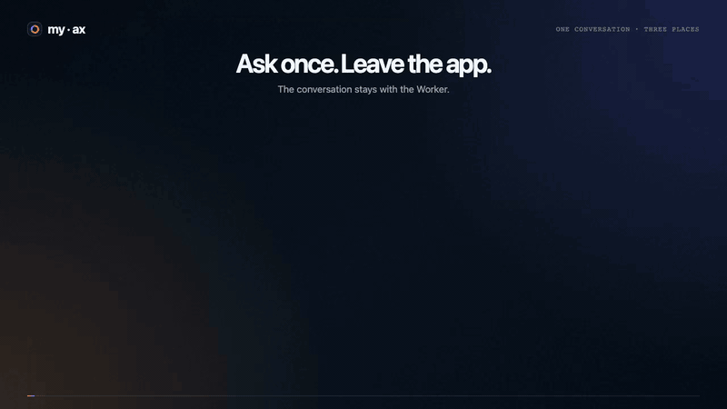

# My Agent Experience

A My AX conversation can keep running after the PWA disconnects. The deployed trace below sends one code task through a snapshot-backed workspace, a connected physical machine, and a Cloudbox run.

Cloudflare Think owns the live conversation. D1 stores a transcript projection for search and export. Computer work enters through `work_search` and `work_code`:

```text
work_search · work_code
       │
       ├─ workspace.*  My AX Workspace
       ├─ machine.*    My Machine
       └─ cloudbox.*   Cloudbox
```

My AX stores its application state, workspace backups, OAuth grants, and configuration in the operator's Cloudflare account. Connected MCP servers, Cloudbox, model providers, and a physical machine retain their own execution and data boundaries.

## How Work Moves

[](./docs/media/my-ax-startup-explainer.mp4)

[Open the 15.8-second MP4](./docs/media/my-ax-startup-explainer.mp4). The checked-in [D3 scene](./docs/media/startup-explainer.html) drives the same deterministic timeline used for the recording: a turn enters the Think agent, `work_search` and `work_code` select methods, and calls fan out to the three work providers.

## A Deployed Run

[](./docs/media/my-ax-kitchen-sink.mp4)

[Open the accelerated MP4](./docs/media/my-ax-kitchen-sink.mp4). One `work_code` call wrote and read `/home/user`, ran `printf MACHINE_OK` through the connected machine, then created a Cloudbox run and read back `CLOUDBOX_OK`. The original interaction took about six seconds; the checked-in video trims startup and runs for 3.4 seconds. This exercises one configured path, not the complete deployment or recovery surface.

## Current Surface

| Status | Capability | Mechanism and Limit |
|---:|---|---|
| Shipped | Conversations | Think owns live messages, streaming, recovery, and compaction. Provider failure can still end a turn. |
| Shipped | My AX Workspace | Sandbox keeps `/home/user`; mutating turns snapshot it to R2. Writes after the last successful snapshot can be lost with the container. |
| Proving | My Machine | `machinectl` opens an outbound connection and publishes its current catalog. It is optional, terminal-equivalent, and unavailable while the companion is offline. |
| Proving | Cloudbox | A configured deployment clones a public repository into a live run. The current adapter creates runs, reads, writes, and executes commands; it cannot publish changes. |
| Shipped | Connected MCPs | Users add public HTTPS MCP servers and complete the server's OAuth flow. Attribution depends on the upstream implementation. |
| Shipped | Voice and Attention | Voice delegates into the same conversation. Push requires VAPID, browser support, and permission; delivery is best-effort. |
| Shipped | Browser and Artifacts | Browser Run records public pages. Svelte artifacts render in sandboxed same-origin previews. Browser Run does not inherit local browser cookies. |

[Feature Status and Limits](./docs/feature-matrix.md) names the checks and source paths behind these rows.

## Work Code Mode

`work_search` returns available methods, location, and live Machinectl input schemas. `work_code` runs one async JavaScript function in an official `@cloudflare/codemode` Dynamic Worker.

The following example assumes Machinectl and Cloudbox are already configured; replace the checkout path and repository:

```js
async () => {
  await workspace.write({
    path: '/home/user/notes.md',
    content: 'Stored in the My AX Workspace',
  });

  const local = await machine.shell({
    command: 'git status --short --branch',
    cwd: '/path/to/current/checkout',
  });

  const run = await cloudbox.run_create({
    repo: 'https://github.com/you/project',
  });

  return { local, runId: run.runId };
}
```

The Dynamic Worker accepts at most `32 KiB` of source, has a `30s` timeout, and has no ambient outbound network access. It receives no raw credentials, environment variables, or service bindings. Host callbacks retain their real authority: `machine.shell` still runs with the connected user's terminal permissions.

## First Authenticated Turn

Requirements:

- Node.js 22 and npm 11
- Docker, Colima, or WSL2; native Windows shells are not tested
- Python 3, Bash, and OpenSSL
- Wrangler authentication with permission to create the listed Cloudflare resources
- Workers, Containers, D1, KV, R2, Workers AI, Browser, and Worker Loader access

Bootstrap the resources and Worker:

```bash
git clone https://github.com/acoyfellow/my-ax
cd my-ax
npm ci
npx wrangler login
bash scripts/setup.sh
```

The script edits the local `wrangler.jsonc`, creates or resolves D1, KV, and R2 resources, generates missing bridge/encryption secrets, applies remote migrations, and deploys. Re-running it preserves existing `BRIDGE_JWT_SECRET` and `MASTER_KEY` values.

The resulting app is not ready yet:

1. Create a Cloudflare Access self-hosted application for the deployment hostname.
2. Set `CF_ACCESS_ISS`, `CF_ACCESS_AUD`, `BRIDGE_BASE_URL`, and `CLOUDFLARE_ACCOUNT_ID`.
3. Add bucket-scoped R2 S3 credentials if `/home/user` must survive container replacement.
4. Configure the model routes you intend to expose.
5. Redeploy with `npm run deploy`.
6. Verify that an anonymous request is rejected or redirected and an authenticated `GET /api` returns `{"ok":true}`.
7. Open the app through Access and submit a conversation turn.

Push additionally needs VAPID secrets. Managed OAuth callbacks need an HTTPS hostname; loopback development cannot complete that flow. [Deploying My AX](./docs/deploy.md) contains commands, update behavior, rollback limits, and troubleshooting.

`npm run check` builds generated assets, typechecks, and runs local tests. It does not test Access, a deployed container, model availability, voice, push delivery, or workspace restoration. The [deployment proof](./proof/README.md) covers selected deployed boundaries.

## Add a Connector

A signed-in user opens **Settings → Connectors → Add**, enters a public HTTPS MCP endpoint, and completes its authorization flow. My AX discovers OAuth metadata, stores tokens encrypted per user, refreshes them server-side, and rejects embedded credentials plus private, loopback, and metadata destinations.

The Access identity scopes My AX data. The upstream OAuth grant may represent a different account. Rotating `MASTER_KEY` makes existing encrypted grants unreadable, so users must authorize those connectors again.

An operator may configure an exact read/query subset for MCP Code Mode. Absent, invalid, new, and unlisted methods stay excluded; native MCP tools remain available for simple calls and explicit side effects. See [Architecture](./docs/architecture.md#browser-and-mcp-surfaces).

## Optional Work Providers

| Provider | Configuration | Unavailable State |
|---|---|---|
| My Machine | Run the separate [`machinectl`](https://github.com/acoyfellow/machinectl) companion. | `machine.*` reports disconnected until the outbound companion reconnects. |
| Cloudbox | Set `CLOUDBOX_URL` and the shared `CLOUDBOX_INTERNAL_TOKEN` secret on both deployments. | `cloudbox.*` reports unavailable when either value is absent. |
| Web Push | Set VAPID subject, public key, and private key; grant browser notification permission. | Attention remains in D1 when push is unsupported, denied, or rejected. |

## Development

```bash
npm ci
npm run check
npm run dev
```

[Local Development](./docs/local-development.md) documents loopback mode and the Access-gated HTTPS tunnel needed for OAuth callbacks.

## Documentation

- [Deploying My AX](./docs/deploy.md)
- [Architecture](./docs/architecture.md)
- [Feature Status and Limits](./docs/feature-matrix.md)
- [Implementation Patterns](./docs/patterns.md)
- [Deployment Proof](./proof/README.md)
- [Security Policy](./SECURITY.md)
- [Contributing](./CONTRIBUTING.md)

## License

MIT
