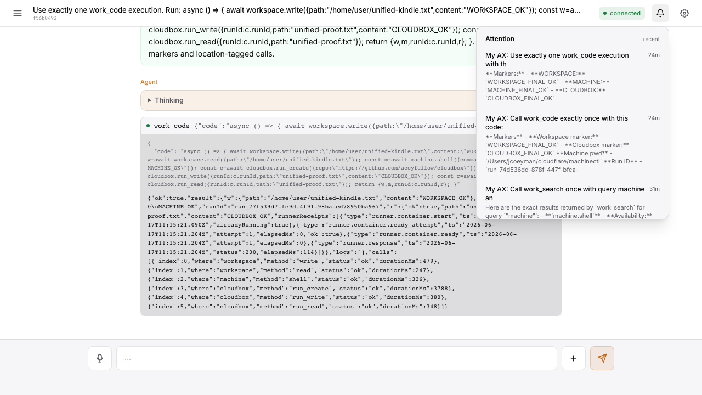

# My Agent Experience

**A personal agent that keeps working when you close the app.**

My Agent Experience (`my-ax`) is a mobile-first agent operating environment you deploy to your own Cloudflare account. Conversations are durable, connected tools use each user's OAuth identity, and the agent can work in the right place for the task without filling its prompt with a large tool catalog.

```text
Ask from phone or desktop
          ↓
My AX chooses where the work belongs
          ↓
My AX Workspace · My Machine · Cloudbox
          ↓
Return to the conversation or receive a push
```

You own the deployment, data, credentials, model routing, and connected tools.

## Five-second demo

[](./docs/media/my-ax-kitchen-sink.mp4)

One `work_code` program writes persistent workspace state, invokes the connected physical machine, and creates a bounded Cloudbox run. The linked MP4 is a 5-second accelerated Unsurf trace captured against the deployed app.

## What ships

- **Durable conversations** — Cloudflare Think owns live sessions, streaming, recovery, reasoning, and compaction. D1 mirrors the complete human transcript for search and export.
- **One programmable work surface** — `work_search` discovers capabilities and `work_code` composes them in an isolated Dynamic Worker.
- **My AX Workspace** — a persistent `/home/user` workspace restored from Cloudflare Sandbox snapshots.
- **My Machine** — optional outbound-only `machinectl` access to local shell, screenshots, accessibility, authenticated state, and verified cmux/Pi sessions.
- **Cloudbox** — optional clean, bounded repository runs for remote execution, continuation, and receipts.
- **Personal tools** — connect public MCP servers with per-user OAuth; exact read/query subsets can optionally run through MCP Code Mode.
- **Voice and attention** — voice uses the same durable conversation; installed PWAs can receive completion and decision pushes.
- **Generated interfaces** — trusted screenshots, browser replays, and sandboxed Svelte artifacts render inline when text is not enough.

## Three places to work

My AX exposes computer work through two model-facing tools:

```text
work_search   discover methods and choose a place
work_code     execute one bounded async JavaScript function
```

The program receives explicit namespaces, never raw credentials, bindings, environment variables, or ambient network access.

```js
async () => {
  await workspace.write({
    path: '/home/user/notes.md',
    content: 'Persistent in My AX',
  });

  const local = await machine.shell({
    command: 'git status --short --branch',
    cwd: '/path/to/current/checkout',
  });

  const run = await cloudbox.run_create({
    repo: 'https://github.com/you/project',
  });

  return { local, runId: run.runId };
}
```

| Namespace | Place | Use it for |
|---|---|---|
| `workspace.*` | **My AX Workspace** | Persistent files, uploads, transforms, background processes, and previews close to the conversation. |
| `machine.*` | **My Machine** | Current local checkouts, logged-in state, desktop interaction, and cmux/Pi sessions. Requires `machinectl`. |
| `cloudbox.*` | **Cloudbox** | Clean clones, isolated edits, remote verification, and proof-producing runs. Requires a Cloudbox deployment. |

My Machine is terminal-equivalent authority, not a sandbox. Cloudbox currently supplies bounded live runs; its durable personal-computer path is still evolving. Consequential publication is not available inside `work_code`.

## Deploy

Requirements:

- Node.js 22+
- npm 11+
- Docker, Colima, or WSL2
- Python 3, Bash, and OpenSSL
- a Cloudflare account with Workers, Containers, D1, KV, R2, Workers AI, Browser, and Worker Loader access
- Wrangler authentication

```bash
git clone https://github.com/acoyfellow/my-ax
cd my-ax
npm ci

npx wrangler login
bash scripts/setup.sh
```

The setup script provisions or resolves the required resources, generates core secrets, applies migrations, and deploys a locked Worker.

> **Cloudflare Access is required in production.** Configure a self-hosted Access application, set `CF_ACCESS_ISS` and `CF_ACCESS_AUD`, and redeploy before using the app. Empty production Access configuration fails closed.

Push notifications and durable workspace snapshots need the additional VAPID and R2 credentials described in [the deployment guide](./docs/deploy.md).

## Use it

### Connect an MCP

Open **Settings → Connectors → Add**, enter a public HTTPS MCP endpoint, and complete its authorization flow. My AX discovers OAuth metadata, stores tokens encrypted per user, refreshes them server-side, and rejects embedded credentials plus private, loopback, and metadata destinations.

A deployment can optionally expose an exact read/query subset through official `@cloudflare/codemode`:

```json
{
  "version": 1,
  "enabled": true,
  "connectors": {
    "github": {
      "expose": ["search_issues", "list_pull_requests", "get_file_contents"]
    }
  }
}
```

The policy is fail-closed. Native MCP tools remain available for simple calls and consequential operations.

### Connect My Machine

Run the optional `machinectl` companion on a computer you control. Its connection is outbound-only; no inbound laptop port is opened. The live catalog determines which local methods My AX may use.

### Connect Cloudbox

Set `CLOUDBOX_URL` and the deployment secret `CLOUDBOX_INTERNAL_TOKEN`. My AX then exposes bounded Cloudbox run methods through `work_search` and `work_code`. The current integration supports creating a live run, reading and writing relative files, and executing bounded commands.

### Install the PWA

Install My AX from a supporting phone or desktop browser. The PWA supports durable sessions, app badges, push notifications, voice, deep links, and an offline shell.

## Architecture

```text
Phone / desktop PWA
  │  chat · voice · push · artifacts
  ▼
Cloudflare Worker + Think agent
  ├─ Durable Objects  user root, conversation facets, OAuth, machine relay
  ├─ D1               session index, transcript mirror, jobs, attention
  ├─ R2               uploads, artifacts, workspace backups
  ├─ Sandbox          persistent My AX Workspace
  ├─ Worker Loader    Work Code Mode and optional MCP Code Mode
  ├─ Browser Run      public-page screenshots and replay
  ├─ machinectl       optional physical-computer provider
  ├─ Cloudbox         optional bounded cloud-run provider
  └─ MCP              user-authorized external tools
```

My AX owns identity, conversation, routing, attention, and approval UX. The providers own where work executes.

## Public engine, private deployment

This repository is the generic engine. The tracked tree is intended to contain no deployment-specific hosts, account resources, MCP names, Access tenant configuration, or secrets.

A private deployment wrapper may:

1. clone a reviewed public revision;
2. inject private Access, model, MCP, Machinectl, and Cloudbox configuration;
3. apply migrations and secrets;
4. deploy and verify the authenticated application path.

Feature work belongs here. Private wrappers should contain configuration, not a divergent fork.

## Develop

```bash
npm ci
npm run check
npm run dev
```

`npm run check` builds generated assets, typechecks, and runs the unit/widget smoke suite. See [local development](./docs/local-development.md) for container and Access details.

## Project map

| Path | Purpose |
|---|---|
| `src/agent.ts` | Durable Think runtime, tool assembly, and work routing instructions. |
| `src/work-tools.ts` | Unified `work_search` and `work_code` surface. |
| `src/think-workspace.ts` | Maps Think workspace operations to persistent `/home/user`. |
| `src/routes/machinectl.ts` | Physical-machine relay and dynamic capability adapter. |
| `src/cloudbox-tools.ts` | Bounded Cloudbox run adapter. |
| `src/connectors.ts`, `src/oauth-store.ts` | MCP registry and encrypted per-user OAuth. |
| `src/voice-think-agent.ts` | Voice lifecycle delegated into canonical conversations. |
| `proof/svelte/` | Svelte PWA and trusted inline result widgets. |
| `scripts/setup.sh` | Self-hosted provisioning and initial deployment. |

## Reference

- [Deployment guide](./docs/deploy.md)
- [Architecture](./docs/architecture.md)
- [Feature matrix](./docs/feature-matrix.md)
- [Patterns](./docs/patterns.md)
- [Security policy](./SECURITY.md)
- [Contributing](./CONTRIBUTING.md)

## License

MIT
